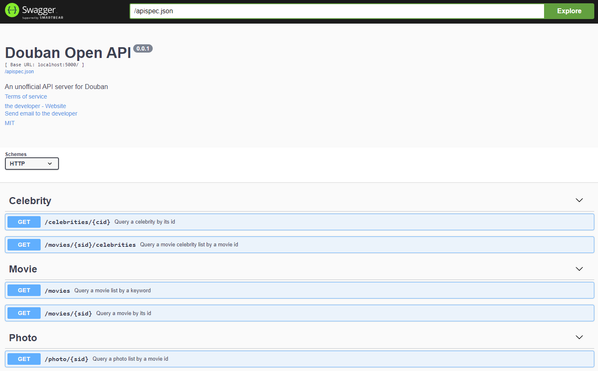

  

# douban-openapi-server

A Douban API server that provides an unofficial method for information gathering, currently, supporting several providers below:

- SeleniumProvider - which will open a headless Chrome to simulate the user interaction (Optional)
- HttpRequestProvider - which has leveraged `Requests & BeautifulSoup` for information gathering with no any browser interaction (By default)
- P2PCacheProvider - `ToDo` (Scrapy/SQLite/IPFS/BitTorrent/Web3Storage/etc) - ???

> Note: Any comments and issues are welcomed!

## Docker 

```shell
docker run --rm -d -p 5000:5000 caryyu/douban-openapi-server:latest
docker run --rm -d -p 5000:5000 caryyu/douban-openapi-server:<commit>
```

> Note: the `commit` can be found from git history of main branch

## Install

 - the toolkits of `python3` and `pipenv` are required by executing the following scripts,

  ```shell
  pipenv install
  pipenv shell

  export FLASK_APP=app.py
  export FLASK_ENV=development
  export FLASK_DEBUG=0
  flask run
  ```

  > Note: There're two providers to choose, by default, `HttpRequestProvider` will take place, which will be faster for information scraping, for `Selenium`, You have to follow the official instruction and build the docker image by yourself

## APIs (Swagger)



# Disclaimer

This is only for research and study, Any copyright violation should count on your own, thanks.

<a href="https://www.buymeacoffee.com/caryyu" target="_blank"></a>
